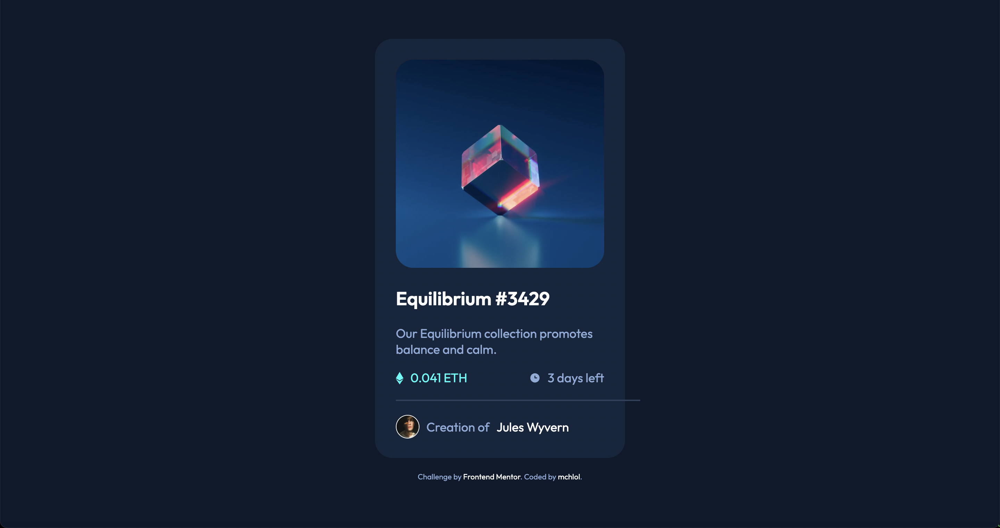
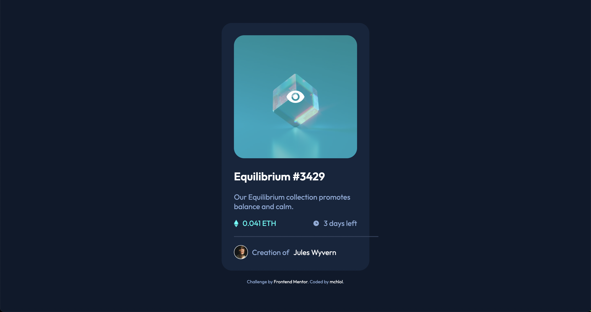

# Frontend Mentor - NFT preview card component solution

This is a solution to the [NFT preview card component challenge on Frontend Mentor](https://www.frontendmentor.io/challenges/nft-preview-card-component-SbdUL_w0U). Frontend Mentor challenges help you improve your coding skills by building realistic projects. 

## Table of contents

- [Overview](#overview)
  - [The challenge](#the-challenge)
  - [Screenshot](#screenshot)
  - [Links](#links)
- [My process](#my-process)
  - [Built with](#built-with)
  - [What I learned](#what-i-learned)
  - [Continued development](#continued-development)
- [Author](#author)

## Overview

### The challenge

Users should be able to:

- View the optimal layout depending on their device's screen size
- See hover states for interactive elements

### Screenshot

  
  

### Links

- Solution URL: [Add solution URL here](https://your-solution-url.com)
-  [Live site](https://mchlol.github.io/nft-preview-card-component/)

## My process

- This is my first time using Sass so, after doing a quick refresh of the [freeCodeCamp Sass section](https://www.freecodecamp.org/learn/front-end-development-libraries/#sass), the first thing I did was get that set up in my project. I used Homebrew to install Dart Sass, and the [Sass docs](https://sass-lang.com/guide) and [this article](https://dev.to/darnocer/how-to-setup-your-project-with-sass-scss-ip4) were very helpful to get it going.  
- Structure the HTML of the page, break up the sections and add classes.  
- Use the provided style guide to import the Outfit font from Google Fonts and create variables for all the colours. I usually use CSS variables but in this case I used Sass.  
- Adjust the sizes to suit the mobile design preview. As it turns out I didn't really need to do anything else to match the desktop preview!  
- Add the active states.  

### Built with

- Semantic HTML5 markup
- Sass variables
- Flexbox
- Mobile-first workflow

### What I learned

Sass is awesome! I haven't used all the features of Sass here but nesting was super helpful to keep things organised. The only thing is when using the terminal to commit to git I have to stop watching Sass and then remember to go back and watch it again. A few times I would be changing things and nothing woudl be updating and then I'd realise I hadn't started watching Sass again.  
  
Another key thing here was creating the transparent cyan layer for the active state on the image. First I thought of using invert() but of course that didn't match the preview.  Then I used opacity which worked great but the icon ended up with the same opacity. I saw a tip in the comments on [this post on CSS Tricks](https://css-tricks.com/almanac/properties/o/opacity/) to use RGB with an alpha value on the colour itself, which won't affect any text in the div. So I took the hsl colour from that Sass variable and used hsla on that element only, which worked perfectly.  

### Continued development

- I definitely feel that I need to learn more about semantic HMTL markup, this is a very simple page though so I'll work on that when I get to more complicated markup.
- This was a good project to dip into Sass for the first time. It's very helpful, but it might be better specifically to use CSS selectors rather than Sass nesting, so I get more comfortable with them. I can see mixins being very useful for more complex pages.  
- Getting the content centered on the page is always annoying, this time I've used flexbox with a wrapper on the main content and it's actually quite simple (also annoying).  

## Author

- Website - [Portfolio](https://mchlol.github.io/portfolio/)
- Frontend Mentor - [@mchlol](https://www.frontendmentor.io/profile/mchlol)

